# SQL Query Execution Flow

## Query Overview

This query builds **customer RFM (Recency, Frequency, Monetary)** features in three stages:

1. Build `order_totals` CTE
2. Build `user_rfm` CTE
3. Generate the final ranked report

---

## Execution Flow Diagram

```mermaid
flowchart TD

    A([Start Query])

    %% ==========================
    %% First CTE
    %% ==========================

    A --> B["CTE 1: order_totals"]

    B --> C["FROM orders"]

    C --> D["INNER JOIN order_items<br/>ON order_id"]

    D --> E["INNER JOIN products<br/>ON product_id"]

    E --> F["WHERE status = 'completed'"]

    F --> G["GROUP BY<br/>order_id, user_id, order_date"]

    G --> H["Calculate Order Value<br/>SUM(price × quantity)"]

    H --> I["Temporary Table:<br/>order_totals"]

    %% ==========================
    %% Second CTE
    %% ==========================

    I --> J["CTE 2: user_rfm"]

    J --> K["FROM users"]

    K --> L["LEFT JOIN order_totals<br/>ON user_id"]

    L --> M["GROUP BY<br/>user_id, country"]

    M --> N["Calculate RFM Features"]

    N --> N1["Recency<br/>JULIANDAY('2024-12-31') - MAX(order_date)"]

    N1 --> N2["Frequency<br/>COUNT(order_id)"]

    N2 --> N3["Monetary<br/>SUM(order_value)"]

    N3 --> N4["Average Order Value<br/>AVG(order_value)"]

    N4 --> N5["Replace NULLs<br/>COALESCE(...,0)"]

    N5 --> O["Temporary Table:<br/>user_rfm"]

    %% ==========================
    %% Final Query
    %% ==========================

    O --> P["Final SELECT"]

    P --> Q["SELECT *"]

    Q --> R["Window Function<br/>RANK() OVER(PARTITION BY country ORDER BY monetary DESC)"]

    R --> S["ORDER BY monetary DESC"]

    S --> T([Final Result])
```



---

# Detailed Execution Order

```text
START
 │
 ▼
Create CTE: order_totals
 │
 ├── Read orders
 │
 ├── Join order_items
 │
 ├── Join products
 │
 ├── Keep only completed orders
 │
 ├── Group rows by order
 │
 ├── Calculate SUM(price × quantity)
 │
 ▼
Temporary Table → order_totals
 │
 ▼
Create CTE: user_rfm
 │
 ├── Read users
 │
 ├── LEFT JOIN order_totals
 │
 ├── Group by user
 │
 ├── Calculate Recency
 │
 ├── Calculate Frequency
 │
 ├── Calculate Monetary
 │
 ├── Calculate Average Order Value
 │
 ├── Replace NULL values using COALESCE
 │
 ▼
Temporary Table → user_rfm
 │
 ▼
Read user_rfm
 │
 ▼
SELECT *
 │
 ▼
Apply Window Function
(RANK within each country)
 │
 ▼
Sort by Monetary DESC
 │
 ▼
FINAL OUTPUT
```

---

# SQL Logical Processing Order

Although the SQL is written from top to bottom, each query block is logically processed in this order:

```
FROM
    ↓
JOIN
    ↓
WHERE
    ↓
GROUP BY
    ↓
Aggregate Functions
(SUM, COUNT, AVG, MAX)
    ↓
SELECT
    ↓
Window Functions
(RANK OVER ...)
    ↓
ORDER BY
```

---

# Data Flow Summary

```
orders
      \
       \
order_items -----> products
       │
       ▼
Calculate Order Totals
       │
       ▼
order_totals (CTE)
       │
       ▼
LEFT JOIN users
       │
       ▼
Generate RFM Features
       │
       ▼
user_rfm (CTE)
       │
       ▼
Apply Country-wise Ranking
       │
       ▼
Sort by Monetary
       │
       ▼
Final Customer RFM Report
```